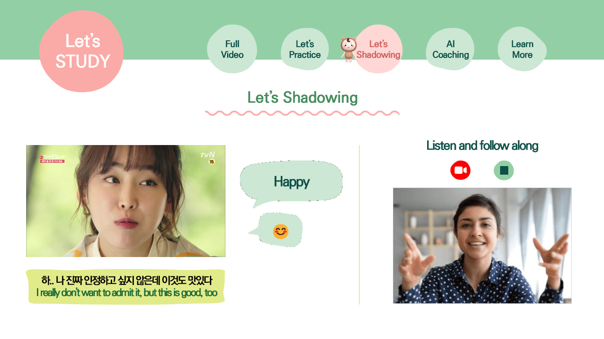
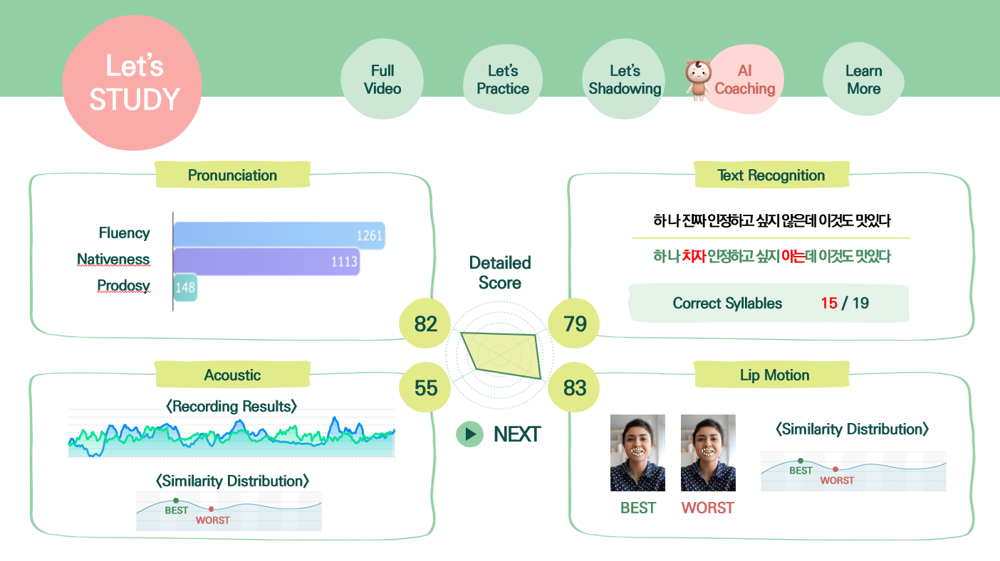

&#128526; 왕누나있조 : **도꺠비 어학당 AI** &#128526; \
MultiCampus Final-Project (2022.06.17~2022.07.29)
#### Description
 ```
 외국인이 배우긴 너무 어려운 한국어!
 K-드라마의 재미있는 컨텐츠로 손쉽게 배우고
 자신이 원하는 컨텐츠로 섀도잉하면서 실력은 쭉쭉 !
 ```
#### Dataset
 ```
 AI허브 > 멀티모달 데이터셋

- 서로 다른 형태의 정보로 이루어져 뚜렷한 특성이 구분되는 데이터
- 1,943개의 한국 드라마 영상 클립(총 21시간 10분 분량, 클립당 1~3분)
- 발화 스크립트, 동영상 및 이미지 상황 설명 등을 포함한 메타파일
- 인물간의 대화 의미를 이해하기 위한 한국어 대화 부분이 반드시 포함
- 평서문과 의문문, 적절한 수위의 비속어, 은어 등을 모두 포함


AI 허브 > 한국어 대화

- 소상공인 및 공공 민원 10개 분야에 대한 50만 건 이상의 대화를 제공하는 자연어 데이터 제공
- SNS, 인스턴트 메신저 등 다양한 플랫폼에서 수집한 일상 자유 대화 데이터의 대화주제, 화행, 화자정보 등을 레이블링한 대화형 텍스트 데이터
- 20여개 주제에 대한 자유로운 일상대화 텍스트를 수집한 후, 각 대화의 주제와 참여 화자정보, 화행이 나타나는 문장에 대한 라벨링을 통해
  한국어 일상대화의 주제, 화행 등 정보를 담은 데이터셋을 구성
  


AI 허브 > 주제별 텍스트 일상 대화

- 20여개 주제에 대한 자유로운 일상대화 텍스트를 수집한 후,
  각 대화의 주제와 참여 화자정보, 화행이 나타나는 문장에 대한 라벨링 
- 한국어 대화(Dialog) 10,000건을 수집하여 100,000 문장과 도메인 및
  카테고리 정보, 의도, 어휘 등을 포함하여 구축
- Q&A형태의 공공 민원 분야 11,082건과 소상공인 분야 90,413건
  총 101,495건 데이터
- 도메인 및 카테고리별로 동의어에 대한 용어사전(thesaurus)을 구축하여
  대표어(headword)와 하위어(word)의 관계를 정의하여 활용


 
```
#### Libs
 ```
gluonnlp==0.10.0
kobert==0.2.3
mmcv==1.6.0
mmcv-full==1.6.0
mxnet==1.7.0.post2
numba==0.56.0
numpy==1.21.6
onnxruntime==1.8.0
openmim==0.2.0
scipy==1.7.3
sentencepiece==0.1.96
torch==1.12.0
transformers==4.21.0
urllib3==1.26.11
```
#### Models
 ```
 Similarity Model (cos-similarity)
 TimeSformer (Action Recognition
 KoBert (GRU, Transformer Model)
 T5 (Transformer Model)
```

#### API
 ```
 NaverCLOVASpeechAPI
 ETRI 한국어 발음 평가 API
```
#### pipeline


#### Results


#### Works cited
BERT: Pre-training of Deep Bidirectional Transformers for Language Understanding
- Jacob / Devlin / Ming-Wei Chang / Kenton Lee / Kristina Toutanova

Exploring the Limits of Transfer Learning with a Unified Text-to-Text Transformer 
- Colin Raffel / Noam Shazeer / Adam Roberts/ Katherine Lee/ Michael Matena/ anqi Zhou / Wei Li / Peter J. / Google / Mountain View / CA 94043

Is Space-Time Attention All You Need for Video Understanding?
- Gedas Bertasius / Heng Wang / Lorenzo Torresani 

#### Contributors
```
 멀티캠퍼스 Final Project 왕누나있조(6조)입니다. 
 신재웅(github/Ukjang), 김성호(github/Kwon-Giil ), 김성진(github/ksw0733), 박찬규(github/luckyspia)
